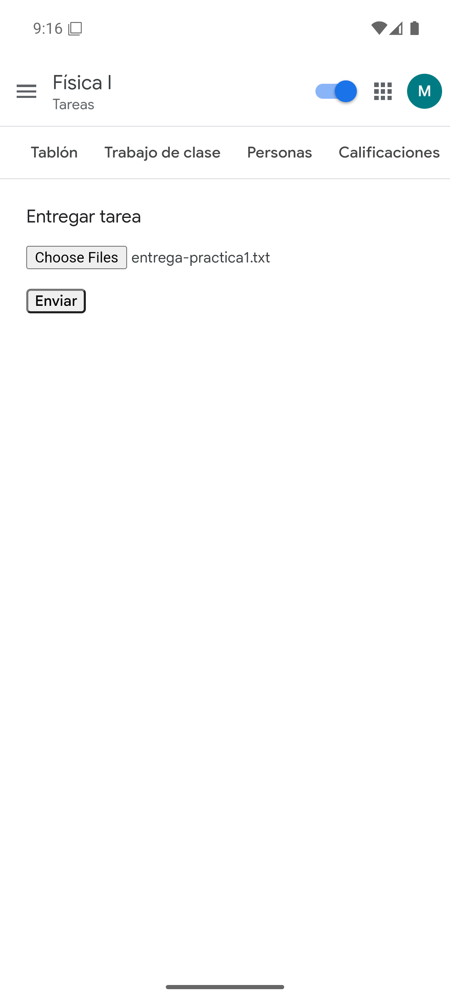

# Nueva interfaz para Sakai

Extensión para Chrome y Brave, y app para Android, que da a las aulas virtuales hechas con [Sakai](https://www.sakailms.org/) —como **PoliformaT** (UPV) o el **Aula Virtual** (UM)— una interfaz moderna al estilo de Google Classroom.

## Funciones

- Página principal con tarjetas de asignaturas y entregas de la semana.
- Menú lateral con favoritas (☆), orden por arrastre, "Mostrar más", selector de curso y colores por asignatura.
- Tablón, Trabajo de clase (tareas, exámenes y materiales por temas), Personas y Calificaciones.
- Pendientes y Calendario semanal de todas las asignaturas.
- Logo y nombre originales de cada universidad.
- Interruptor para volver a la vista original en cualquier momento.

Más detalles en [poliformat-classroom/README.md](poliformat-classroom/README.md).

## App para Android

**Aula Sakai** es la versión para móvil: la misma interfaz dentro de una app ligera (≈110 KB).

- Descarga el APK desde la [última versión](https://github.com/miguelcoxcaballero/sakai-nueva-interfaz/releases/latest) y ábrelo en el móvil (Android 7 o superior). Si Android lo pide, permite instalar apps de esa fuente.
- Al abrirla eliges tu aula: PoliformaT, Aula Virtual UM u otra aula Sakai. Para cambiarla, mantén pulsado el icono → «Cambiar de aula».
- Subida de archivos desde el móvil, Drive o Fotos; los PDF se abren en un visor propio (zoom con dos dedos o doble toque, «Abrir con» y «Compartir»); el resto de archivos se abren con la app que corresponda.

  
  
  
  

Código en [`android/`](android/). Para compilar: `cd android && gradlew assembleRelease` (necesita el SDK de Android y un `keystore.properties` con la clave de firma, que no se sube al repositorio).

## Instalar la extensión en modo desarrollador

1. Abre `brave://extensions` (o `chrome://extensions`) y activa el **Modo de desarrollador**.
2. Pulsa **Cargar descomprimida** y elige la carpeta `poliformat-classroom`.

## Estructura

| Carpeta / archivo | Contenido |
| --- | --- |
| `poliformat-classroom/` | La extensión (manifest, scripts, estilos, iconos). |
| `android/` | App para Android (WebView nativo que reutiliza la interfaz de la extensión). |
| `mock/` | Servidor de pruebas que imita la API de Sakai: `node mock/server.js` y abre http://localhost:8123/portal. |
| `docs/` | Política de privacidad (publicada con GitHub Pages). |
| `store/` | Capturas, imagen promocional y textos para la Chrome Web Store. |
| `empaquetar.py` | Genera el ZIP para subir a la tienda en `dist/` (`python empaquetar.py`). |

## Privacidad

La extensión no recoge ni envía datos: todo se procesa en el navegador con la sesión del propio usuario. Ver la [política de privacidad](docs/index.html).

Proyecto independiente, no afiliado a ninguna universidad, a Sakai ni a Google.
