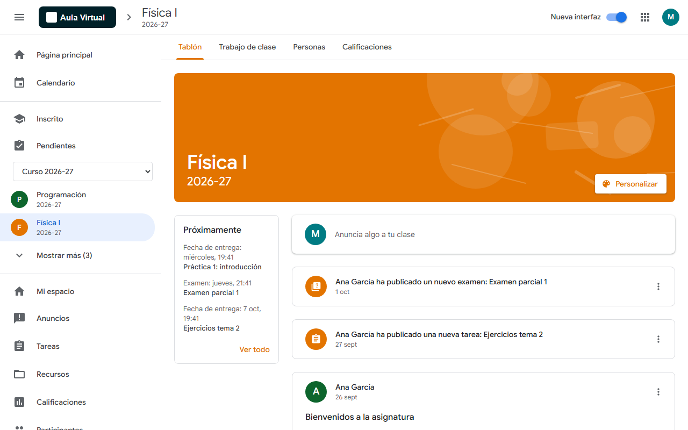
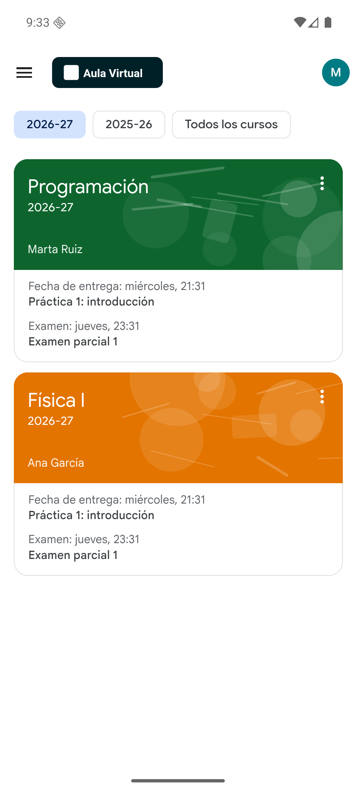
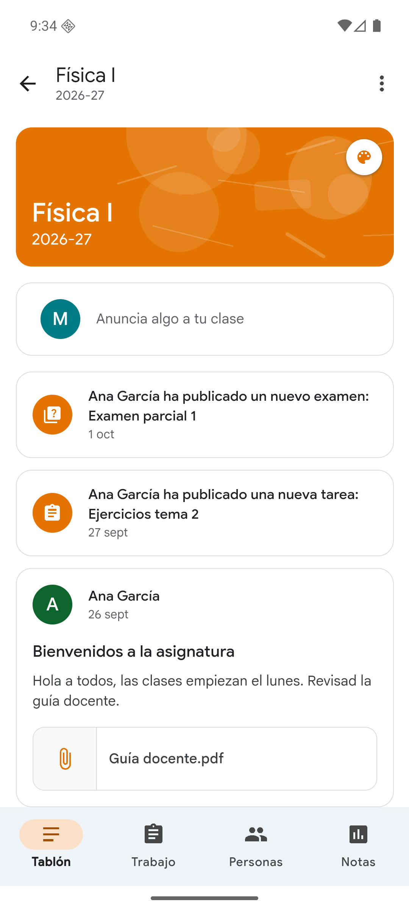
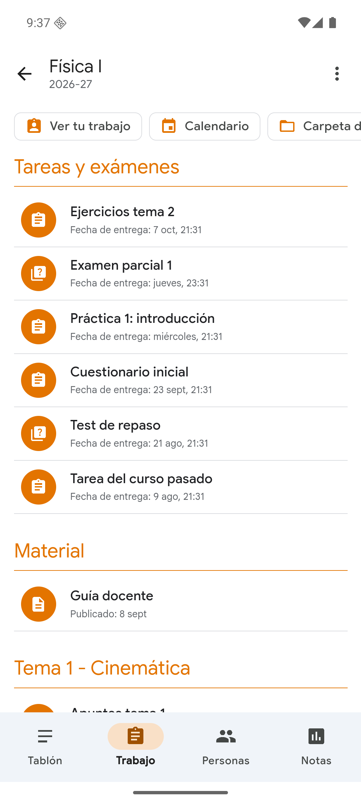
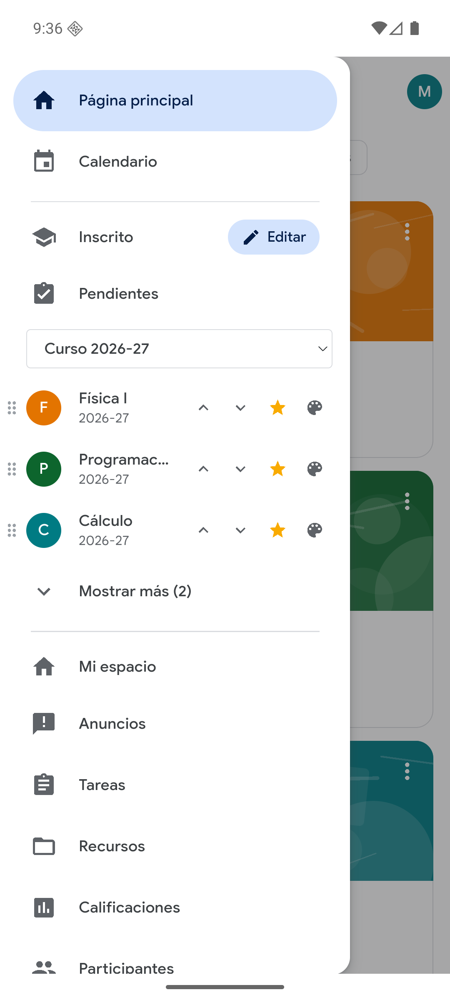
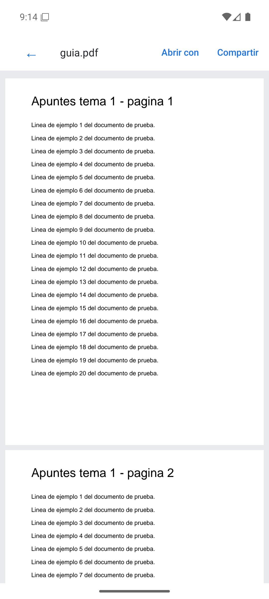

# Nueva interfaz para Sakai

> 📱 **[Descargar Aula Sakai 1.1.2 para Android (APK)](https://github.com/miguelcoxcaballero/sakai-nueva-interfaz/raw/main/aula-sakai-release-v1.1.2.apk)** — ábrelo en el móvil para instalarlo. Las siguientes versiones se instalan solas desde la app.

Extensión para Chrome y Brave, y app para Android, que da a las aulas virtuales hechas con [Sakai](https://www.sakailms.org/) —como **PoliformaT** (UPV) o el **Aula Virtual** (UM)— una interfaz moderna al estilo de Google Classroom.



## Funciones

- Página principal con tarjetas de asignaturas y entregas de la semana.
- Menú lateral con favoritas (☆), orden por arrastre, "Mostrar más", selector de curso y colores por asignatura.
- Tablón, Trabajo de clase (tareas, exámenes y materiales por temas), Personas y Calificaciones.
- Pendientes y Calendario semanal de todas las asignaturas.
- Logo y nombre originales de cada universidad.
- Interruptor para volver a la vista original en cualquier momento.

Más detalles en [poliformat-classroom/README.md](poliformat-classroom/README.md).

## App para Android

**Aula Sakai** es la versión para móvil, con el aspecto de la app de Classroom para Android (barra de navegación inferior, tarjetas redondeadas, menú lateral de Material You). Muy ligera (≈120 KB).

- Descarga el APK de la [última versión](https://github.com/miguelcoxcaballero/sakai-nueva-interfaz/releases) (etiquetas `android-vX.Y.Z`) y ábrelo en el móvil (Android 7 o superior).
- Al abrirla eliges tu aula: PoliformaT, Aula Virtual UM u otra aula Sakai. Para cambiarla, mantén pulsado el icono → «Cambiar de aula».
- **Favoritas sincronizadas**: son las asignaturas fijadas de Sakai, así que el ordenador (extensión), el móvil y la web de Sakai muestran las mismas y en el mismo orden. En el móvil se editan con «Editar» en el menú lateral (☆, ↑ ↓ y colores) o con el menú ⋮ de cada tarjeta.
- Subida de archivos desde el móvil, Drive o Fotos; visor de PDF propio (zoom, «Abrir con», «Compartir»).
- **Actualizaciones dentro de la app**: al abrirla, al volver a ella y cada 15 minutos consulta [`android-update.json`](android-update.json); si hay una versión nueva muestra «Actualización obligatoria», descarga el APK dentro de la app y abre el instalador de Android.

<p>
  
  
  
  
  
</p>

### Publicar una versión nueva de la app

```
python publicar_android.py 1.2.0 "Qué cambia"
```

Compila el APK firmado, crea la release `android-v1.2.0` con `aula-sakai-release-v1.1.2.apk`, actualiza `android-update.json` y hace push. Las apps instaladas pedirán actualizar en cuanto lo detecten. Necesita la clave de firma (`android/keystore.properties` y `android/aula-sakai-release.keystore`), que no se sube al repositorio.

## Instalar la extensión en modo desarrollador

1. Abre `brave://extensions` (o `chrome://extensions`) y activa el **Modo de desarrollador**.
2. Pulsa **Cargar descomprimida** y elige la carpeta `poliformat-classroom`.

## Estructura

| Carpeta / archivo | Contenido |
| --- | --- |
| `poliformat-classroom/` | La extensión (manifest, scripts, estilos, iconos). |
| `android/` | App para Android (WebView nativo que reutiliza la interfaz de la extensión). |
| `mock/` | Servidor de pruebas que imita la API de Sakai: `node mock/server.js` y abre http://localhost:8123/portal. |
| `docs/` | Política de privacidad (publicada con GitHub Pages). |
| `store/` | Capturas, imagen promocional y textos para la Chrome Web Store. |
| `empaquetar.py` | Genera el ZIP para subir a la tienda en `dist/` (`python empaquetar.py`). |

## Privacidad

La extensión no recoge ni envía datos: todo se procesa en el navegador con la sesión del propio usuario. Ver la [política de privacidad](docs/index.html).

Proyecto independiente, no afiliado a ninguna universidad, a Sakai ni a Google.
